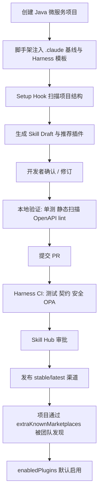
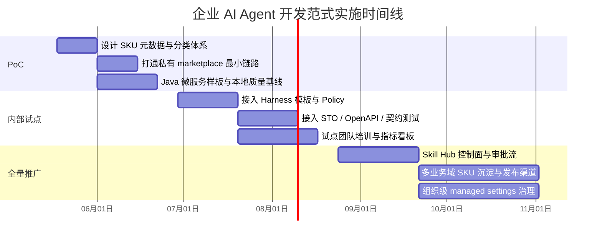

# 基于 Claude Code 的企业级 AI Agent 开发范式与工程化落地方案

## 执行摘要

这份方案的核心判断是：你要构建的“Skill Hub + SKU 分发 + Java 微服务工程化规范”是可落地的，但不应把它理解为一个完全独立的新概念平台，而应理解为对 **Claude Code 官方原生能力的企业化封装**。从官方能力映射看，最接近你想法的底座并不是一个内建的 “Skill Hub” 产品，而是 **skills、plugins、marketplaces、managed settings、hooks、MCP、subagents** 这一整套组合能力；因此，企业内的 Skill Hub 最合理的实现方式，是一个“**私有技能目录与分发层**”，对外暴露 Claude Code 已支持的 marketplace / plugin source 形态，对内叠加企业自己的分类、审批、审计、搜索、版本、权限与发布治理。citeturn4view0turn6view0turn5view0turn14view0turn29search9

如果目标是“让团队无感地积累知识、沉淀业务开发套路、自动生成可复用 Java 微服务能力包，并在开发过程中自动拉取和应用”，推荐采用 **双层架构**：第一层是 **项目初始化层**，负责把工程脚手架、测试基线、OpenAPI 约束、静态分析和 Harness 流水线模板一次性装入项目；第二层是 **运行时增强层**，通过 Claude Code 插件和私有 marketplace，在 IDE/CLI 中按需拉取、启用、更新 Skill/SKU，从而把“知识沉淀”和“工程控制”嵌入日常开发。这样既能保留你过去用 npm 包初始化项目的经验，又更贴近 Claude Code 官方的分发与治理模型。citeturn24view1turn4view2turn5view0turn16view3turn12view0turn12view3

对 Java 微服务场景，我的总体建议是：**脚手架用 Maven/Gradle 作为权威入口，npm 只保留为跨语言 bootstrap 包装器；Skill/SKU 用 Claude Code plugin 作为权威分发单元；企业 Skill Hub 以私有 Git marketplace 为起点，以 Git + 私有 npm registry 双通道为目标形态；质量门禁则统一落在 Harness 模板 + Policy as Code + STO + Test Intelligence 上。** 这样能把“开发体验、工程治理、复用分发、审计合规”四件事拆开治理，而不是把它们全部塞进一个插件里。citeturn5view0turn8view0turn8view3turn12view4turn12view5turn12view6turn12view8

从 ROI 角度看，Claude Code 官方已经提供了 **DAU、sessions、lines accepted、suggestion accept rate、PRs with Claude Code、lines of code with Claude Code** 等原生分析指标；成本上，官方给出的企业部署经验中，平均费用约为 **每活跃开发者每日 13 美元、每月 150–250 美元**，这使得你完全可以把 PoC 做成“有量化回报”的项目，而不是只讲愿景。需要注意的是，如果未来你要求 **Zero Data Retention**，Claude Code 的贡献分析能力会受限，只保留部分使用类指标，因此审计与 ROI 统计最好同步接入 OpenTelemetry 和内部观测体系。citeturn4view9turn30view0turn29search0

## 目标与价值

企业级目标不应只定义为“让大家都用 AI 写代码”，而应定义为四个可衡量的组织结果：**统一知识入口、统一工程约束、统一复用分发、统一质量闭环**。其中，知识入口对应 Skill/SKU 的标准化载体与分类体系；工程约束对应项目模板、权限、hook、MCP、流水线模板和 OPA 策略；复用分发对应私有 Skill Hub / marketplace；质量闭环对应本地自测、PR 校验、CI 测试、契约/规范校验、安全扫描、可回滚发布。这个目标设定与 Claude Code 的组织级部署模型、插件分发模型以及 Harness 的模板与治理能力是对齐的。citeturn29search9turn14view0turn12view0turn12view2turn12view3

建议把 KPI 分成“采用、效率、质量、治理”四组，而不是只看“代码写得快不快”。Claude Code 原生可直接获取的指标包括日活用户、会话数、建议接受率、Claude Code 参与的 PR 数、Claude Code 参与代码行数、每用户成本等；Harness 一侧则适合承载测试通过率、平均流水线时长、关键漏洞拦截数、策略阻断次数、JUnit 测试可见性等指标。两边结合，才能避免“AI 用得多，但工程质量反而下滑”的假繁荣。citeturn4view9turn30view0turn12view9turn12view10turn12view6turn12view8

| 维度 | 推荐 KPI | 说明 | 首阶段建议目标 |
|---|---|---|---|
| 采用 | DAU、sessions、suggestion accept rate | 是否真实进入日常开发 | 试点团队周活跃率 ≥ 60% |
| 效率 | 初始化到可编码时间、首个 PR 周期、复用命中率 | 是否真正减少重复劳动 | 新服务初始化时间下降 50% 以上 |
| 质量 | 单测通过率、集成测试通过率、OpenAPI lint 通过率、契约测试通过率 | 是否形成“先规范后生成” | 试点服务质量门禁覆盖率 ≥ 80% |
| 安全与治理 | Critical/High 漏洞阻断数、OPA 策略阻断数、未审批 SKU 发布数 | 是否形成可控分发 | 未审批发布为 0 |
| 复用 | SKU 拉取次数、跨团队复用 SKU 数量、废弃 SKU 比例 | 是否形成技能资产沉淀 | 有效复用 SKU 占新增 SKU 的 30% 以上 |

上表里，**DAU / sessions / suggestion accept rate / PRs with CC / lines with CC** 属于 Claude Code 官方已有分析项；而测试、安全与策略类指标更适合交由 Harness 与企业内部数据仓库承载。换句话说，Claude Code 适合回答“AI 有没被用起来”，Harness 适合回答“这些改动有没有按组织要求被验证过”。citeturn4view9turn12view4turn12view5turn12view6turn12view8

预期收益主要来自三类杠杆。第一类是 **模板化收益**：同类 Java 微服务可以复用同一组 harness template、工程规则和验证路径；第二类是 **知识复利收益**：一个团队把业务流程、错误模式、接口规范、排障步骤沉淀成 Skill 后，其他团队可以直接拉取；第三类是 **治理自动化收益**：通过 managed settings、strictKnownMarketplaces、allowed hooks / MCP / permissions、Harness Policy step 与 STO，企业可以把“哪些能力允许被 AI 使用、哪些必须经过检查”变成系统规则，而不是口头约定。citeturn20view0turn16view1turn17view0turn12view2turn12view3turn12view6

主要风险也很明确。第一，**把 Skill 当文档仓库** 会导致命名混乱、描述重复、版本失控；第二，**把 hook 当强制治理工具** 会踩到能力边界，因为 Setup hook 本身不能阻断流程；第三，**把插件当万能容器** 会遇到官方限制，例如 plugin subagent 不支持 `hooks`、`mcpServers`、`permissionMode`；第四，若采用 ZDR，Claude Code 的贡献指标会缩水；第五，若没有设计版本/审批/废弃策略，Skill Hub 很快会变成“二次知识垃圾场”。citeturn14view1turn31view0turn4view9turn8view2turn8view3

## 目标架构与工程集成

从官方能力映射看，你可以把企业 Skill Hub 定义为一层“**面向 Claude Code 客户端兼容的私有目录服务**”：开发者在 VS Code 中使用 Claude Code 扩展，扩展本身就是官方推荐方式，并且可在命令菜单里直接访问 plugins、MCP、hooks、permissions 等配置入口；插件本身通过 marketplace 分发，而 marketplace 又可以由仓库级 `.claude/settings.json` 自动向团队成员推荐安装。也就是说，Claude Code 进入 IDE 已经有“入口”，你真正要建设的是“企业自己的内容层和治理层”。citeturn24view1turn24view0turn16view3turn8view4

Claude Code 的插件模型与 Skill Hub 诉求天然匹配。官方文档明确说明：plugin 是一个自包含目录，可以包含 **skills、agents、hooks、MCP servers、LSP servers、monitors、settings** 等组件；skills 采用 `SKILL.md`，plugin 通过 `.claude-plugin/plugin.json` 声明元数据，并通过 marketplace catalog 进行分发。更关键的是，marketplace 中的 plugin source 已支持 **相对路径、GitHub、通用 git URL、git-subdir、npm package**，这意味着你的 Skill Hub 不需要发明新协议，而应该发布 Claude Code 已理解的产物。citeturn6view0turn8view0turn5view0

组织级治理要落在 **作用域与策略** 上，而不是落在“培训纪律”上。Claude Code 具有 **Managed / User / Project / Local** 四级作用域，Managed 最高优先级且不可覆盖；`extraKnownMarketplaces` 负责“让团队成员看到你推荐的市场”，`enabledPlugins` 负责“默认启用哪些插件”，`strictKnownMarketplaces` 负责“只允许哪些市场来源”，`allowManagedHooksOnly` 则可以让企业只信任由组织强制启用插件带来的 hooks。这个组合足够支撑企业私有 Skill Hub 的准入、预装和白名单控制。citeturn14view0turn16view2turn16view3turn16view1turn17view0

对 Skill Hub 私有化部署，我建议采用“**控制面 + 发布面 + 消费面**”三层架构。控制面负责 UI、分类、审批、审计、权限、搜索与元数据；发布面负责把最终产物转换并发布成官方兼容的 `marketplace.json`、plugin source（git / npm）和版本标签；消费面则通过 Claude Code 的 marketplace / plugin 安装机制被 IDE 或 CLI 使用。换句话说，企业 Skill Hub 的“内部 API”可以是你自定义的，但“外部分发 API”最好仍然输出 Claude Code 已支持的 marketplace / plugin source 形态。这个判断直接来自官方 source type 与 marketplace 机制。citeturn5view0turn16view3turn29search9

```mermaid
flowchart LR
    A[开发者在 VS Code 中使用 Claude Code] --> B[项目级 .claude/settings.json]
    B --> C[发现 extraKnownMarketplaces / enabledPlugins]
    C --> D[安装企业插件与技能包]
    D --> E[Setup Hook / 分析器执行]
    E --> F[生成项目画像与 Skill 草稿]
    F --> G[开发者确认 / 修订]
    G --> H[提交到 Skill Hub 控制面]
    H --> I[审批 / 分类 / 版本化 / 审计]
    I --> J[发布 marketplace.json 与 plugin source]
    J --> K[团队项目无感拉取更新]
    K --> L[Harness CI/CD 模板与质量门禁执行]
```



上面的流程里，**无感** 不应理解为“完全无提示”。Claude Code 的仓库级 marketplace 机制本身是在 **信任项目目录之后，提示成员安装市场和插件**；因此最合理的 UX 是“最少显式操作”，而不是“绕过信任边界”。企业真正应该做的，是把默认市场、默认插件和默认权限规则准备好，让第一次进入项目后的交互足够轻。citeturn16view3turn8view4

与 urlHarness 平台turn10search1 的集成重点，不是“把 Skill Hub 嵌在 CI 页面里”，而是把工程化约束体系化。Harness 官方文档显示，模板可以复用步骤、阶段和流水线逻辑；Policy as Code 基于 OPA，可在保存、运行和步骤级别执行策略；CI 可运行 Java 构建和测试；Test Intelligence 可按代码变更选择相关测试；STO 可在流水线中做 SAST/SCA 并阻断发布。对你的方案而言，这意味着：**Claude Code 负责把“生成”和“复用”做顺手，Harness 负责把“执行”和“放行”做严谨。**citeturn12view0turn12view1turn12view2turn12view3turn4view6turn12view4turn12view5turn12view6turn12view7turn12view8

下面这张表建议把 Claude 原生 metadata 与企业扩展字段明确分层，避免后续把所有治理字段都硬塞进 `plugin.json`。`plugin.json` 与 `marketplace.json` 应承载客户端需要理解的最小元数据；企业扩展字段则放进 Skill Hub 自己的 registry metadata 中。citeturn8view0turn8view1turn5view0turn8view3

| 字段 | 层级 | 是否 Claude 原生 | 说明 | 示例 |
|---|---|---:|---|---|
| `name` | plugin manifest / marketplace | 是 | SKU/插件唯一标识，建议 kebab-case | `java-order-service` |
| `version` | plugin manifest / marketplace | 是 | 发布版本；稳定渠道建议显式维护 | `1.3.0` |
| `description` | plugin / skill frontmatter | 是 | 用途与触发条件的摘要 | `生成 Spring Boot CRUD 微服务骨架` |
| `author` | plugin manifest | 是 | 维护团队 | `Platform Engineering` |
| `category` | marketplace | 是 | 用于组织市场分类 | `java-microservice` |
| `tags` / `keywords` | marketplace / plugin | 是 | 检索关键词 | `java,spring-boot,openapi,harness` |
| `dependencies` | plugin manifest | 是 | 依赖的其他 plugin，可带 semver 约束 | `[{ "name": "security-baseline", "version": "~2.1.0" }]` |
| `skills` / `hooks` / `agents` / `mcpServers` | plugin manifest | 是 | 组件路径或配置 | `./skills/` |
| `skuType` | 企业扩展 | 否 | 知识 / 开发 / 业务 / 通知 / 规范 | `业务开发` |
| `domain` | 企业扩展 | 否 | 业务域归属 | `订单域` |
| `scope` | 企业扩展 | 否 | 组织 / BU / 项目 | `BU` |
| `runtime` | 企业扩展 | 否 | 技术栈约束 | `Java 21 + Spring Boot 3` |
| `compatibility` | 企业扩展 | 否 | 插件 / 模板 / JDK / 框架兼容矩阵 | `Claude Code >= 2.1.98` |
| `qualityGateLevel` | 企业扩展 | 否 | 发布前必须通过的质量等级 | `L2` |
| `approvalStatus` | 企业扩展 | 否 | 草稿 / 评审中 / 已批准 / 废弃 | `已批准` |
| `ownerTeam` | 企业扩展 | 否 | 责任团队 | `Order Platform Team` |
| `dataClass` | 企业扩展 | 否 | 数据分类与敏感级别 | `内部` |
| `deprecatedAt` / `replacement` | 企业扩展 | 否 | 废弃策略 | `2026-12-31 / java-order-service-v2` |

这张表里，`name / version / description / author / category / tags / dependencies / component paths` 对应 Claude Code 官方 manifest 与 marketplace schema；`skuType / domain / scope / qualityGateLevel / approvalStatus / dataClass` 则属于企业必须自己补充的治理字段。实践上，建议在 Skill Hub 控制面保存一份更完整的 JSON 元数据，再由发布器产出“Claude 可消费子集”。citeturn8view0turn8view1turn5view0turn8view3

## 开发者体验与 SKU 管理

对 Java 场景，我不建议再把“项目初始化”和“运行期技能分发”混成一个 npm 包。更稳妥的分工是：**Maven Archetype / Gradle Convention Plugin 负责初始化工程；Claude Code Plugin 负责运行期智能能力；npm CLI 仅作为跨语言 bootstrap 包装器保留。** 这样既符合 Java 团队的习惯，也符合 Claude Code 插件与 marketplace 的官方模型。如果保留 npm 入口，它最适合做的事是“一键调用内部模板服务、写入 `.claude/settings.json`、装配项目元数据”，而不是直接承担所有 Java 工程约束。citeturn5view0turn4view6turn28view0

初始化体验建议设计成“**一次进入项目，完成三件事**”：其一，脚手架与 `.claude/` 基线就位；其二，Setup hook 扫描项目并生成项目画像；其三，画像被转成 Skill 草稿或推荐插件集。需要特别注意，官方说明 **Setup hook 可以注入 `additionalContext`，但不能阻断执行**，因此它非常适合做“初始化分析”和“上下文增强”，不适合做“强制门禁”。强制门禁应交给 permissions、managed settings 和 Harness 流水线策略。citeturn14view1turn17view0turn12view2turn12view3

对于“自动化分析生成 skill”，建议不要直接输出最终版 Skill，而是输出 **Skill Draft**。Draft 可以包含：模块边界、关键 API、典型命令、依赖服务、测试入口、常见故障、OpenAPI 端点、注意事项。开发者只做少量确认与修订后发布。这样能显著降低“AI 自动生成知识噪音”的概率，也符合 harness engineering 里“guides + sensors”的思路：先用确定性分析器和结构化输入收缩空间，再让模型补足语义说明。citeturn20view0turn14view1

SKU 的分类不要只用“知识 / 开发 / 业务 / 通知”四个大桶，否则半年后必然失控。企业内至少要加四个维度：**业务域、技术拓扑、生命周期、风险级别**。例如：业务域可分订单/库存/支付；技术拓扑可分 CRUD API、事件消费者、批处理、BFF；生命周期可分 draft / beta / stable / deprecated；风险级别可分 low / regulated / security-sensitive。这样既利于搜索，也利于默认推荐和审批路由。citeturn20view0turn5view0

SKU 的发布流程建议采用“**作者发布、域负责人评审、平台发布器生成 marketplace**”的三段式。作者侧只负责维护源码目录、`SKILL.md`、`plugin.json` 和测试；CI 中先执行 `claude plugin validate` / `/plugin validate` 思路的结构校验，再跑单测、契约与安全门禁；通过后由平台发布器更新企业 catalog 与发布渠道。Claude Code 官方已明确支持显式版本与 commit SHA 两种版本模型；建议企业内部仍以 **SemVer + 稳定/最新双渠道** 为主，避免所有团队都跟着最新提交漂移。citeturn7view2turn8view3turn27search9turn23search0



“无感拉取 SKU”的体验边界也要说清。官方仓库级 `extraKnownMarketplaces` 并不是静默强装，而是在团队成员 **信任项目目录后提示安装 marketplace 和 plugins**；这非常适合企业内的“默认推荐 + 用户可见 + 有安全边界”的设计。若你确实需要更强的组织控制，应使用 managed settings 预注册与白名单 market，而不是靠本地脚本偷偷修改用户配置。citeturn16view3turn16view1turn14view0

还需要明确一个容易踩坑的限制：**plugin subagent 不支持 `hooks`、`mcpServers`、`permissionMode` frontmatter**。这意味着如果某类业务 SKU 需要强权限、专属 MCP、或差异化交互限制，它就不应只做成 plugin subagent，而应该拆成“plugin skill + 项目/托管 subagent + managed permissions”的组合。把能力边界设计清楚，会比把所有东西都塞进插件里更可维护。citeturn31view0

## 自动化质量保障

从方法论上，你的方案最适合套用“harness engineering”的思路：把 AI 开发过程分成 **guides（前馈约束）** 与 **sensors（反馈传感器）**，并区分 **computational（确定性）** 与 **inferential（推理型）** 两类控制。对企业 Java 微服务来说，前者就是模板、代码规范、架构规则、OpenAPI 风格指南、Skill 描述；后者就是测试、静态分析、安全扫描、AI review、日志与流水线反馈。真正成熟的企业范式，不是“让 AI 直接做”，而是“让 AI 在收缩后的空间里做，并被连续验证”。citeturn20view0

本地快速反馈层建议至少放入五类确定性控制。第一类是 **编码规范**，用 entity["software","Checkstyle","Java coding standard checker"] 做统一样式与命名约束；第二类是 **缺陷静态分析**，用 entity["software","SpotBugs","Java static analysis tool"] 检测 bug pattern，并可叠加 Find Security Bugs 做安全规则扩展；第三类是 **架构边界测试**，用 entity["software","ArchUnit","Java architecture test library"] 检查模块依赖、分层和循环依赖；第四类是 **自动化重构配方**，用 entity["software","OpenRewrite","automated refactoring framework"] 执行安全修复、框架升级和一致性整理；第五类是单元测试。这样做的价值在于，Claude Code 改完代码后，本地即可被一轮确定性规则快速校正。citeturn32view6turn32view5turn34search0turn32view4turn32view7

接口质量层建议强制把 entity["software","OpenAPI Specification","HTTP API interface description standard"] 纳入发布对象，而不是只把代码纳入发布对象。OpenAPI 规范本身就是语言无关的 HTTP API 描述标准；Spring 生态下可用 springdoc 的 Maven 或 Gradle 插件在构建期间生成 OpenAPI 文档；再用 Spectral 对 API 风格、命名和描述质量做 lint，把“规范校验”变成流水线中的确定性步骤，而不是评审人的个人喜好。citeturn32view0turn32view1turn33view0

集成与契约层建议采用“双轨制”。对服务内部行为，用集成测试验证数据库、消息、容器化依赖和关键路径；对服务间交互，用 entity["software","Pact","contract testing tool"] 做 HTTP / message contract tests。Pact 文档明确指出，契约测试通过让应用在隔离状态下验证“消息是否符合共享约定”，避免把所有服务都部署起来才能发现集成错误，这对于你的“很多微服务、很多业务模块”的场景尤其重要。citeturn32view3

CI 层应直接利用 Harness 的现成能力，而不是重复造轮子。Harness CI 可在 Linux 平台上构建与测试 Java 应用，支持 Harness Cloud 或自管 Kubernetes 构建基础设施；其 Tests 页面对 JUnit XML 有明确要求，因此自测流水线、集成测试和契约测试报告都应输出成 JUnit XML，统一回传构建详情页；Test Intelligence 则可按代码变化选择 Java 相关测试并支持并行拆分。对开发者体验来说，这能把“AI 改代码后的验证反馈”重新沉淀到统一 UI。citeturn4view6turn12view9turn12view10turn12view4turn12view5

安全与合规层最推荐的组合是 **STO + OPA Policy**。Harness STO 的定位就是把扫描直接编排进流水线，并做去重、优先级整理与治理；在 SCA 侧，STO 内置工作流当前使用 OWASP Dependency Check 与 OSV；在阻断侧，可用 Policy as Code 写 OPA 规则，对安全测试结果执行“发现 Critical / New Critical 即失败”等策略。这意味着你可以把“技能可发布”与“服务可上线”都做成统一门禁，而不是把安全判断留到人工 review。citeturn12view6turn12view7turn12view8turn12view2turn12view3

回滚策略应分成 **SKU 侧回滚** 与 **服务侧回滚**。SKU 侧依赖 Claude Code 官方版本机制：显式 `version` 适合 stable 发布节奏，commit SHA 适合内部快速迭代，依赖可加 semver 约束，跨市场依赖必须显式 allowlist；服务侧则通过 Harness 发布流水线回退到前一已知良好版本。更实用的建议是：所有企业插件至少维护 `stable` 与 `latest` 两个渠道，默认项目只跟 `stable`，平台团队与试点团队使用 `latest`，避免试点噪音污染全员体验。citeturn8view3turn8view5turn8view3turn7view3turn27search9

对审计与安全基线，建议同时启用两条线：一条是 Claude Code 自身的 OpenTelemetry 导出与使用分析，用来记录工具调用、耗时、成本和失败点；另一条是 managed settings 下的 `strictKnownMarketplaces`、`allowManagedHooksOnly`、必要时的 ConfigChange hooks，用来约束哪些市场、哪些 hooks、哪些设置变更是允许的。这样才能既回答“系统做了什么”，又回答“它被允许做什么”。citeturn29search0turn26view2turn16view1turn17view0turn35search4turn35search12

## 实施路线图与资源估算

预算、团队规模、现有内部 Git / OIDC / 制品库 / Kubernetes / Harness 部署状态均**未指定**。以下估算以“企业已经具备私有 Git、基本 OIDC、至少一套 Harness CI 能力，Java 服务主要跑在标准化构建环境中”为前提；如果你还没有这些底座，时间和人力都应上调。Harness 官方已经说明 Java 构建可以运行在 Harness Cloud 或自管 Kubernetes 集群之上，因此这类基础设施准备是现实可行的。citeturn4view6



建议把路线图拆成三阶段推进。**PoC 阶段** 只做一条“最短闭环”：一个 Java 微服务模板、一个企业基础插件、一个私有 marketplace、一个最小 Harness pipeline。PoC 的成功标准不是“平台做得很完整”，而是“从空仓库到出一个通过质量门禁的 PR，能否稳定复现”。如果这条链路打不通，再多的 Skill Hub 设计都只是 PPT。citeturn5view0turn24view1turn12view0turn12view3

**内部试点阶段** 应重点解决四件事：第一，SKU 分类是否够清晰；第二，生成 Skill Draft 的准确性是否够高；第三，Harness 模板与 OPA 策略是否真能兜住底线；第四，团队是否愿意把高价值经验沉淀成插件而不是继续口头传播。这个阶段建议只选 2–3 个服务拓扑，例如“标准 CRUD API”“事件消费者”“对外 BFF”，不要一开始铺开全部业务类型。这样也更符合 harness engineering 提到的“topology / harness template”思路。citeturn20view0turn12view0turn12view1

**全量推广阶段** 才值得投入真正的 Skill Hub 控制面建设，包括分类管理、审批流、版本通道、审计看板、废弃策略、搜索体验、基于业务域的可见性、以及与内部组织架构的权限联动。原因很简单：如果在 PoC 前就做完整门户，你很可能会把大量精力花在“管理不存在的内容”上；而如果在试点中已经证明 Git marketplace + 少量发布器足够支撑复用，全量阶段自然会知道 UI 和流程到底应解决哪些真实问题。citeturn5view0turn16view3turn29search9

| 阶段 | 时间估算 | 主要产出 | 人力估算 | 基础设施要求 |
|---|---:|---|---:|---|
| PoC | 4–6 周 | 1 个 Java 样板、1 个基础企业插件、1 条最小 CI 链路 | 3–5 人 | 私有 Git、基础 Harness CI、测试环境 |
| 内部试点 | 8–12 周 | 2–3 类服务拓扑、分类体系、初版审批流、指标看板 | 5–8 人 | 增加安全扫描、策略、OpenAPI 与契约检测 |
| 全量推广 | 12–16 周 | Skill Hub 控制面、稳定/最新渠道、组织级治理 | 6–10 人 | OIDC、审计、对象存储/索引、可观测性 |

这里的人力配置建议至少覆盖五种角色：平台后端 / Java 工程化、Claude Code 插件与脚手架、Harness pipeline / OPA / 安全、前端或门户、以及试点业务代表。若人力不足，优先顺序应该是：**先保证样板工程与质量门禁，再做门户，再做高级搜索与推荐。** 这是因为企业范式真正的价值不在于“有个 Hub 页面”，而在于“生成出来的东西默认就是对的、能过门禁、能被复用”。这是推断性建议，但与官方能力边界和实施复杂度是一致的。citeturn5view0turn12view3turn12view6turn29search9

本方案当前仍有几个开放问题。第一，你们内部现有制品分发基座是 Git 优先、npm 优先，还是已有统一制品库，这会影响 Skill Hub 发布面的实现方式；第二，是否要求 Zero Data Retention，会影响采用统计方案；第三，微服务是否存在多种 Java 基线与框架版本，需要单独做兼容矩阵；第四，业务知识是否允许进入共享 Skill，还是要做域内可见性分层。以上都不会推翻总体架构，但会显著影响实施优先级。citeturn4view9turn18view0turn14view0

## 示例模板与替代方案

下面给出一个“Java 微服务 SKU”推荐目录结构。这里的关键不是目录长什么样，而是 **把生成、约束、验证、分发四类资产放在不同位置**：业务生成逻辑放 `skills/`，自动规则放 `hooks/`，工程元数据放 `.claude-plugin/`，Java 工程约束放构建文件与测试目录，企业默认启用与市场注册放 `.claude/settings.json`。这一布局与 Claude Code 官方 plugin 结构是一致的。citeturn6view0turn8view2

```text
java-order-service-sku/
├── .claude-plugin/
│   └── plugin.json
├── skills/
│   ├── bootstrap-service/
│   │   └── SKILL.md
│   ├── generate-controller/
│   │   └── SKILL.md
│   ├── generate-openapi/
│   │   └── SKILL.md
│   └── self-test/
│       └── SKILL.md
├── hooks/
│   └── hooks.json
├── bin/
│   └── analyze-project.sh
├── templates/
│   ├── pom.xml.mustache
│   ├── application.yml.mustache
│   └── harness-pipeline.yml.mustache
├── archetype-resources/
│   └── src/...
├── docs/
│   └── README.md
└── package.json
```

一个最小的 Claude Code plugin manifest 可以这样写。官方要求如果存在 manifest，`name` 是唯一必填字段；`version` 决定显式版本更新行为；`dependencies` 可加 semver 约束；skills、hooks、agents、MCP/LSP 配置都可以在 manifest 或 marketplace 一侧声明。citeturn8view0turn8view1turn8view3

```json
{
  "$schema": "https://json.schemastore.org/claude-code-plugin-manifest.json",
  "name": "java-order-service-sku",
  "version": "1.3.0",
  "description": "企业 Java 订单微服务开发 SKU，含脚手架、OpenAPI、测试与自测流程",
  "author": {
    "name": "Platform Engineering"
  },
  "keywords": ["java", "spring-boot", "openapi", "harness", "microservice"],
  "category": "java-microservice",
  "skills": "./skills",
  "hooks": "./hooks/hooks.json",
  "dependencies": [
    { "name": "security-baseline", "version": "~2.1.0" }
  ]
}
```

一个适合“生成 + 自测”的 `SKILL.md` 示例应尽量把使用条件、边界和输出要求写清楚。对有副作用的流程，例如发布、切库、发通知，应显式使用 `disable-model-invocation: true`，避免 Claude 自动触发。官方文档也明确说明 `description` 推荐提供，`allowed-tools` 可以给技能授予激活时无需逐次确认的工具权限。citeturn15view3turn15view5turn15view0

```md
---
name: self-test
description: 为当前 Java 微服务执行本地自测。用于开发完成后验证单测、架构规则、OpenAPI 与静态扫描。
disable-model-invocation: true
allowed-tools: Bash(mvn test *) Bash(mvn verify *) Read Grep Glob
---

请对当前服务执行如下步骤，并汇总结果：

1. 运行单元测试与集成测试
2. 运行 ArchUnit 规则
3. 生成并校验 OpenAPI 文档
4. 运行 Checkstyle、SpotBugs 和安全规则
5. 输出失败项、定位建议、可复制命令
6. 如果全部通过，生成适合 PR 描述的“验证摘要”
```

对 Java 工程，最关键的构建片段之一，是在构建阶段生成 OpenAPI 文档并纳入验证流程。springdoc 官方文档明确给出了 Maven / Gradle 生成文档的能力与基本配置方式；下例示意了 Maven 侧的最小集成方式。citeturn32view1

```xml
<build>
  <plugins>
    <plugin>
      <groupId>org.springframework.boot</groupId>
      <artifactId>spring-boot-maven-plugin</artifactId>
      <executions>
        <execution>
          <goals>
            <goal>start</goal>
            <goal>stop</goal>
          </goals>
        </execution>
      </executions>
    </plugin>

    <plugin>
      <groupId>org.springdoc</groupId>
      <artifactId>springdoc-openapi-maven-plugin</artifactId>
      <version>1.5</version>
      <executions>
        <execution>
          <id>generate-openapi</id>
          <goals>
            <goal>generate</goal>
          </goals>
        </execution>
      </executions>
    </plugin>
  </plugins>
</build>
```

如果你仍希望保留 npm 作为“统一初始化器”，建议把它定位成一个 **企业 bootstrap CLI**，而不是 Java 逻辑本身的承载体。它只负责：拉取模板、写入 `.claude/settings.json`、注入方便的命令、触发内部模板服务。真正的 Java 规则仍回到 Maven/Gradle。citeturn5view0turn28view0

```json
{
  "name": "@company/agent-sku-bootstrap",
  "version": "0.4.0",
  "bin": {
    "agent-sku-init": "bin/init.js"
  },
  "files": [
    "bin",
    "templates",
    ".claude"
  ],
  "scripts": {
    "init:java-service": "node bin/init.js --type java-service",
    "publish:plugin": "node bin/publish-plugin.js"
  }
}
```

仓库级 Claude Code 设置建议保持极简，只做“推荐市场”和“默认启用插件”两件事。这样既能保证团队共用入口，又不至于把所有个人偏好都写进仓库。官方文档说明，这类仓库设置会在成员信任项目目录后触发安装与启用提示。citeturn16view3turn8view4

```json
{
  "extraKnownMarketplaces": {
    "company-tools": {
      "source": {
        "source": "git",
        "url": "https://git.example.com/platform/claude-marketplace.git"
      }
    }
  },
  "enabledPlugins": {
    "java-order-service-sku@company-tools": true,
    "security-baseline@company-tools": true
  }
}
```

如果短期内做不了完整私有 Skill Hub，可以按下面的替代顺序落地。**替代方案一**：直接在项目仓库内维护 `.claude/skills`、`.claude/settings.json` 和 Harness 模板，不做市场；优点是快，缺点是无法跨项目复用与治理。**替代方案二**：只做“私有 Git marketplace”，不做控制面 UI；优点是最贴近官方模型，缺点是分类、审批、统计体验弱。**替代方案三**：如果 Claude Code 插件边界限制了你的场景，例如需要更强的 MCP、权限控制或后台任务，可以用 urlClaude Agent SDKturn25search0 在内部服务中跑相同 agent loop，再把结果回流到 IDE 或流水线。官方文档说明 Agent SDK 与 Claude Code 共享同一 agent loop、skills、hooks 与 OpenTelemetry 观测能力。citeturn26view0turn26view3turn26view4turn26view2

如果你的企业由于合规或计费原因不能直连 Claude API，官方当前支持通过第三方提供方或 LLM gateway 使用 Claude Code。文档明确提到可通过 Vertex AI、Microsoft Foundry、Amazon Bedrock 或符合要求的 LLM gateway 接入；gateway 模式能提供集中认证、成本控制、审计日志与模型路由。对大型企业而言，这通常比在每台开发者机器上直接分发密钥更可控。citeturn19search16turn18view1turn19search1turn18view0

## 参考来源

以下来源是本报告使用的主要依据，优先包含官方文档与一线最佳实践资料：

- urlClaude Code 组织级部署指南turn29search9
- urlClaude Code 设置与作用域文档turn27search0
- urlClaude Code Skills 文档turn27search1
- urlClaude Code VS Code 集成文档turn27search2
- urlClaude Code 插件与 marketplace 文档turn27search9
- urlClaude Agent SDK 总览turn25search0
- urlClaude Code OpenTelemetry 监控文档turn29search0
- urlHarness 官方开发者文档首页turn10search14
- urlHarness Templates 文档turn12view0
- urlHarness Policy as Code 文档turn12view2
- urlHarness Test Intelligence 文档turn12view4
- urlHarness STO 文档turn12view6
- urlOpenAPI Specification 官方规范turn21search0
- urlspringdoc OpenAPI 插件文档turn21search1
- urlSpectral 官方介绍turn21search18
- urlPact 官方文档turn21search3
- urlArchUnit 官方文档turn22search1
- urlSpotBugs 官方文档turn22search16
- urlCheckstyle 官方文档turn22search3
- urlOpenRewrite 官方文档turn22search6
- urlHarness engineering for coding agent usersturn10search7